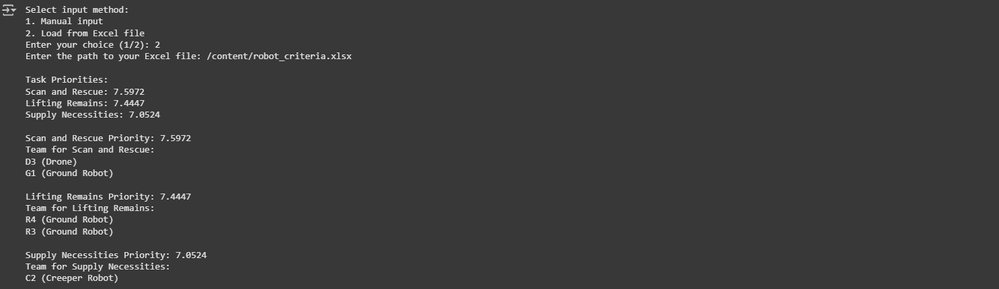

For the Search&Rescue_with_input_options.py File, an input File in Excel format is to be provided by the user for execution. This option has been provided for the user's convenience. If you wish to provide the input through an external file choose this format.
The robot_criteria.xlsx Excel file contains the criteria comparison matrix, robot specifications, and task scores for the algorithm to execute.
Once the code is executed, a prompt, as shown in the figure below, will be available for the user to choose from, allowing them to either select an input file for execution or manually enter the values.

Once the user selects option 2, the system prompts the user to provide the file path as shown below.

Now select the Files option in Google Colab from the left corner of the Google Colab Output Window, as shown below.

Upload the input file robot_criteria.xlsx provided in this repository.

Once the File is successfully uploaded, click on the three dots on the right side of the file name and copy the file path.

Once the File path is given, the system will execute the algorithm as shown below.

