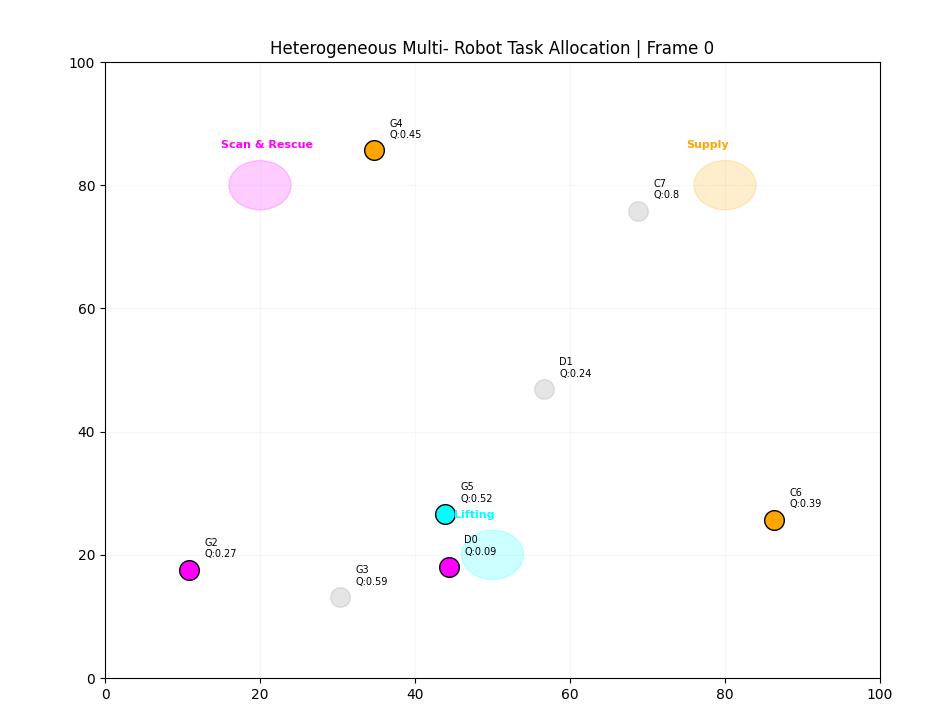
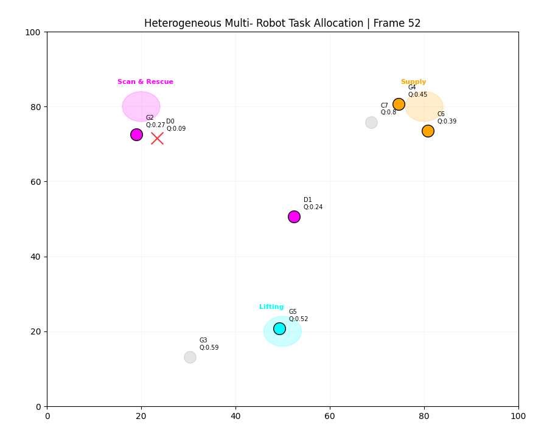
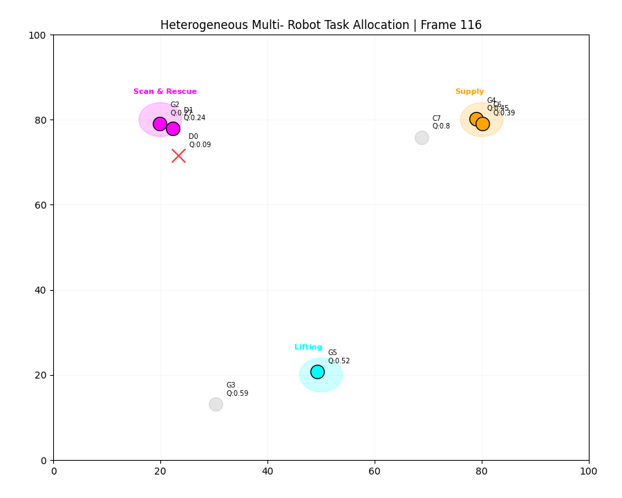
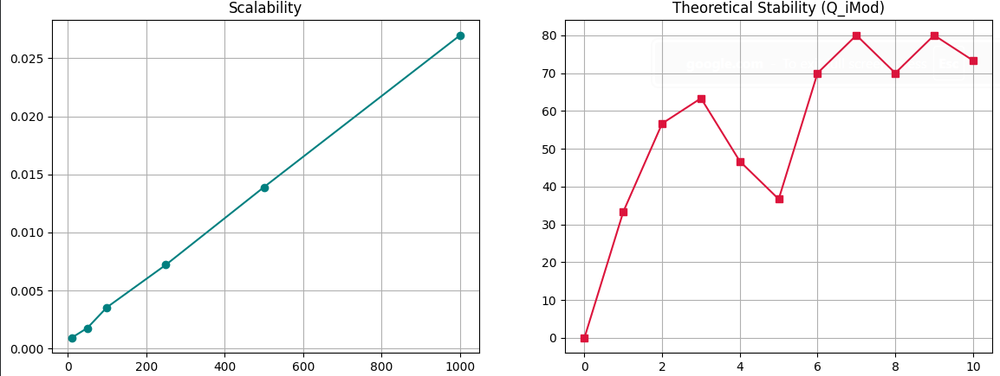

The implementation of the algorithm with an asynchronous event bus in Google Colab is depicted in this folder. Follow the same steps as in the DATA_INPUT_INSTRUCTIONS in Google_Colab_Installation for executing the simulation. The user can use the same robot_criteria_populated.xlsx file as the inputs.

# Project Data

The image depicts the initial team formation phase with respect to the task priority in a search and rescue scenario with three different tasks executing simultaneously.

Once an operation stall happens, another robot available in the nearest proximity will take over the task as shown in below images.

The scalability and the sensitivity of the algorithm when there is a fluctuation upto 10 percent is depicted below.

